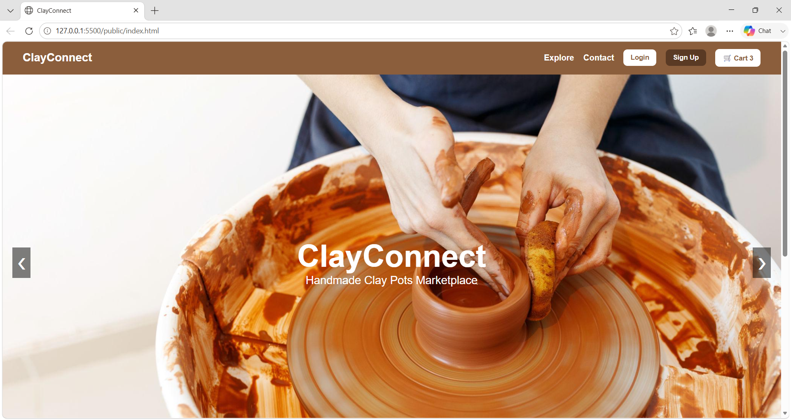
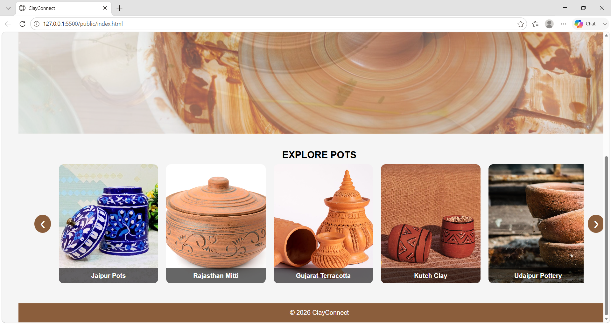
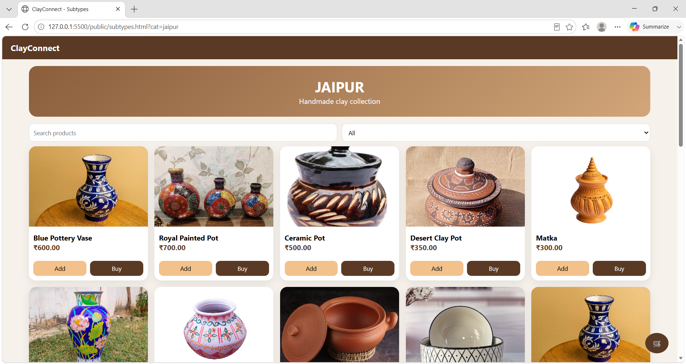
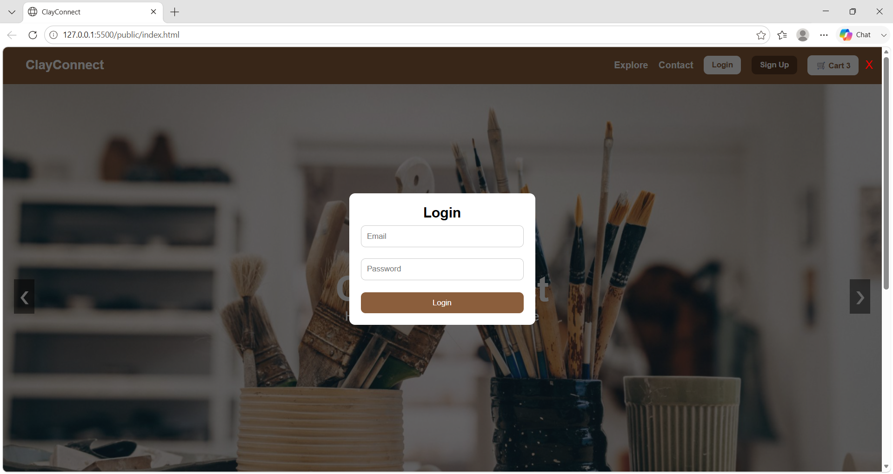
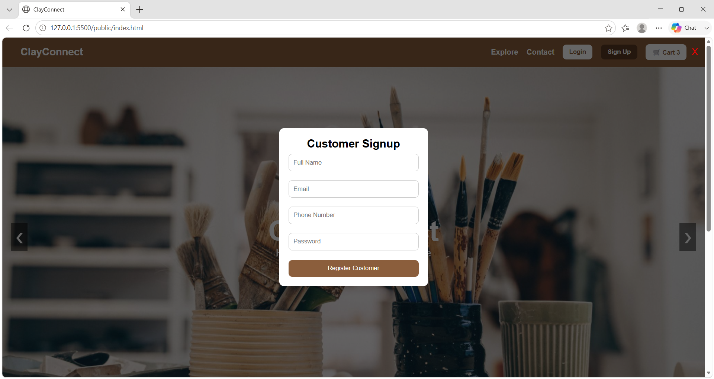
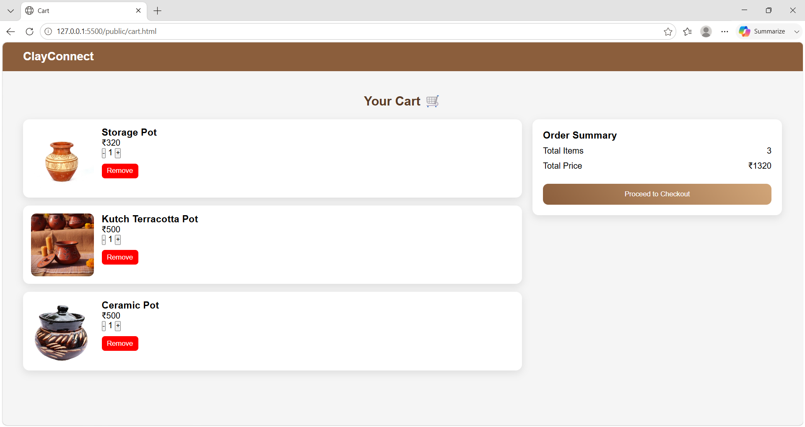
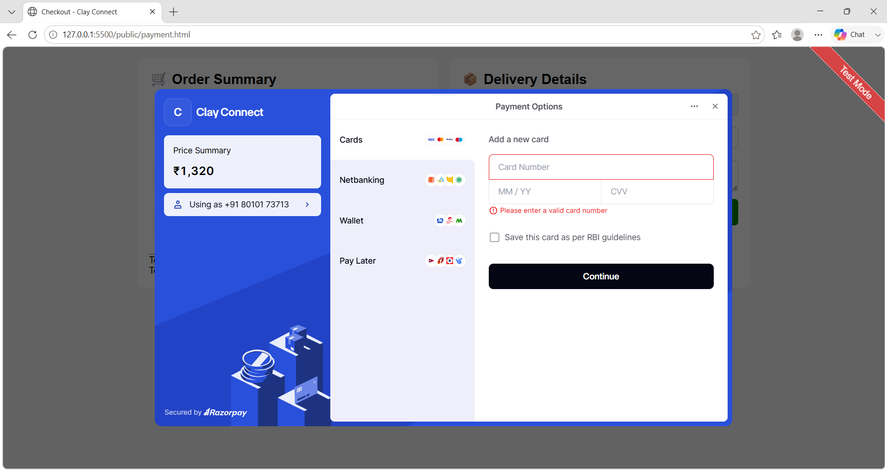
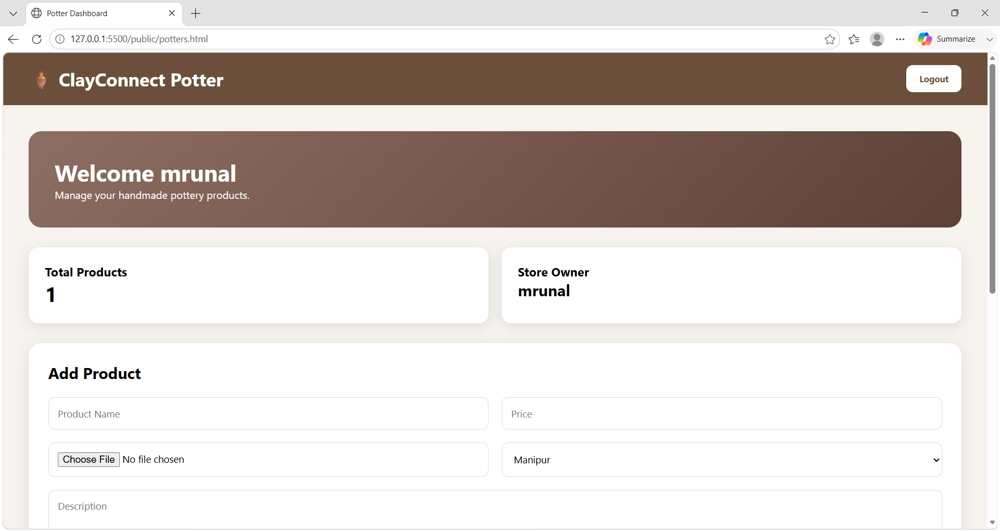
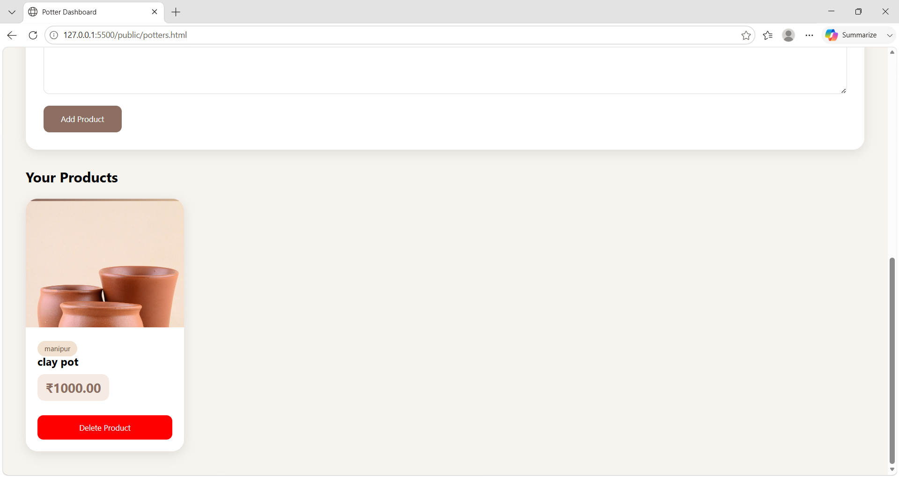
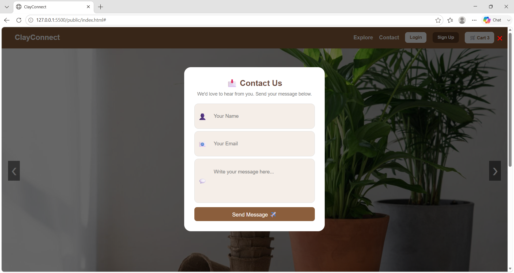

# ClayConnect

A full-stack pottery marketplace web application developed to connect local potters with customers through a digital platform. The application allows customers to browse and purchase pottery products while enabling potters to manage and sell their own pottery products online.

---

## Project Overview

ClayConnect was developed as a BSc Information Technology final year project. The application provides separate modules for customers and potters including authentication, product management, cart functionality, order placement, and payment integration.

---

## Features

### Customer Features
- Customer registration and login
- Browse pottery products
- Product category filtering
- Add products to cart
- Buy Now functionality
- Order placement
- Payment integration
- View order details

### Potter Features
- Potter registration and login
- Potter dashboard
- Add products with image upload
- View listed products
- Delete products

### Additional Features
- JWT Authentication
- Password encryption using bcrypt
- Image upload using Multer
- REST API integration
- Responsive user interface
- MySQL database connectivity

---

## Tech Stack

### Frontend
- HTML5
- CSS3
- JavaScript

### Backend
- Node.js
- Express.js

### Database
- MySQL

### Libraries & Tools
- JWT
- bcrypt
- Multer
- Razorpay
- Git
- GitHub

---

## Project Structure

```bash
ClayConnect
│
├── backend
│   ├── config
│   │   ├── db.js
│   │   └── multer.js
│   │
│   ├── middleware
│   │
│   ├── routes
│   │
│   ├── uploads
│   │
│   ├── utils
│   │
│   └── server.js
│
├── public
│
├── Screenshots
│
└── README.md
```

---

## Screenshots

### Home Page



### Home Products



### Main Page



### Login Page



### Customer Registration


### Potter Registration



### Cart Page



### Payment Page



### Potter Dashboard



### Product Management



### Contact Page



---

## Installation

Clone the repository:

```bash
git clone https://github.com/Shweta-Dhage/ClayConnect.git
```

Navigate to the project folder:

```bash
cd ClayConnect
```

Install dependencies:

```bash
npm install
```

Start the backend server:

```bash
cd backend
node server.js
```

Server runs on:

```bash
http://localhost:5000
```

---

## Learning Outcomes

- Developed REST APIs using Express.js
- Implemented JWT-based authentication
- Worked with MySQL database operations
- Implemented file upload functionality
- Structured backend using routes and middleware
- Used Git and GitHub for version control
- Improved debugging and problem-solving skills

---

## Future Enhancements

- Admin dashboard
- Product reviews and ratings
- Order tracking system
- Search and advanced filters
- Email notifications

---

## Author

**Shweta Dhage**

📧 Email: shwetadhage66@gmail.com

🔗 LinkedIn: https://linkedin.com/in/shweta-dhage-41039a2b6

💻 GitHub: https://github.com/Shweta-Dhage